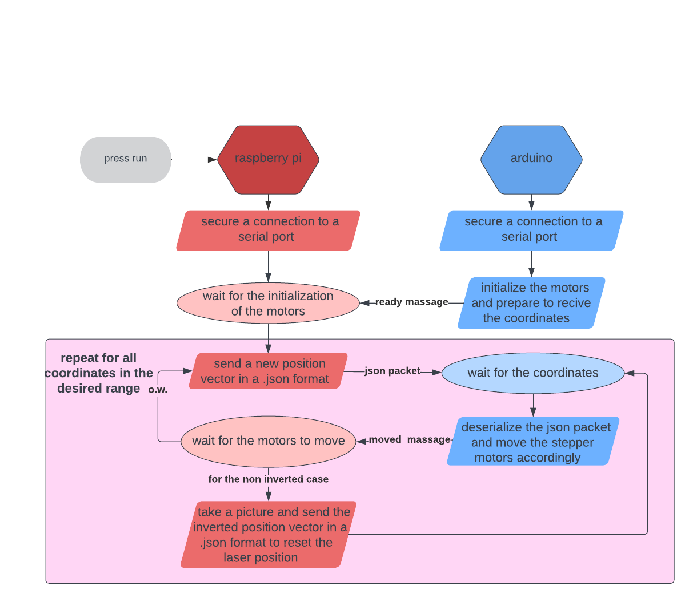

# Laser calibration
# data collection process:
- **Arduino** - serial_comm_arduino.ino: 
This script is used to recieve a json file with a position to move to,
deserialize it and move 3 stepper motors accordingly.
- **Raspberry py** - data_collection.py: 
this script communicates with the arduino. it sends it a position to move to decoded in a json file,
and waits for an ack message. Then it captures a picture using the picamera and saves it in a directory
that is *hard coded* in the code. The next step is telling the arduino to nove back to the initial position.
there is a range of positions to iterate through that are also hard coded and should be changed manually if necessary. 
The following schematic shows the process: 

# Deep learning model
original images: (1280, 960,3) images 
data transforms: turning the images to tensors 
The selected model: a pre-trained resNet-18 , with a modified FC layer 
Loss function : MSE 
optimizer: Adam 
Learning rate: starts at 0.01 and decreases by 70% every 8 epochs  
# Results
The MSE loss decreases significantly (starts at ~3, ends at ~0.05).  
Test loss is as below:  

