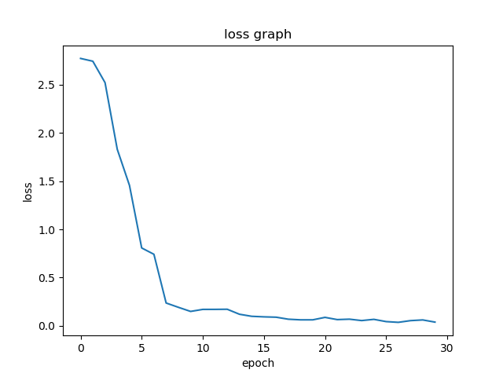

# Laser calibration
# data collection process:
- **Arduino** - serial_comm_arduino.ino: 
This script is used to recieve a json file with a position to move to,
deserialize it and move 3 stepper motors accordingly.
- **Raspberry py** - data_collection.py: 
this script communicates with the arduino. it sends it a position to move to decoded in a json file,
and waits for an ack message. Then it captures a picture using the picamera and saves it in a directory
that is *hard coded* in the code. The next step is telling the arduino to nove back to the initial position.
there is a range of positions to iterate through that are also hard coded and should be changed manually if necessary. 
The following schematic shows the process: 
  
**In order to collect new data, follow the following steps:**  
1. Upload the *data_collection.ino* script to your Arduino  
2. In *data_collection.py*, change *root_dir* to the local directory in which you want to save the images.  
3. Still in *data_collection.py*, change the fields *bottom_bound*, *upper_bound* and *range_arr*. They're all organized in this order: [x,z,theta].
bottom_bound should be the lowest number of motor spins for each coordinate, upper_bound is the highest and range_arr determines the 
difference between each consecutive locations. 
4. Modify *num_iterations* to the number of images you wish to take for each coordinate. 
5. Run *data_collection.py* on your Raspberry-pi with the correct [camera module with the Sony IMX477 sensor](https://www.adafruit.com/product/4561).   
# Deep learning model
original images: (1280, 960,3) images 
data transforms: turning the images to tensors 
The selected model: a pre-trained resNet-18 , with a modified FC layer 
Loss function : MSE 
optimizer: Adam 
Learning rate: starts at 0.01 and decreases by 70% every 8 epochs  
**In order to train a model:**  
Please change the *data_dir* variable in *train/main.py* to be the local directory that you saved the images in.  
Now run the script and you'll have a file named *model_params.pth* that contains the trained model's parameters. 
# Results
The MSE loss decreases significantly (starts at ~3, ends at ~0.05).  
Test loss is as below:  

