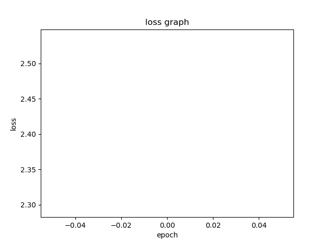

# Laser calibration
This repo contains code scripts to collect data of a laser beam's location using stepper motors that move the laser. 
The steppers are assumed to be controlled by an Arduino controller. 
We included some 3D models that we used to connect stepper motors to optical stages. 
This repo also contains a script for training a deep learning model to estimate the coordinates of the beam. 
# 3D models
For the ones who wish to build a similar setup by connecting 5mm stepper motors to ThorLabs' manual stages,
we included some useful 3D models under the folder *3D_models_STL_files*: 
The first is a coupler that connects the motor's shaft to the manual stage, named *coupler_13mm.stl*
and the second is *stepper_holder_z.stl* that is a stand for the motor.
# data collection process:
- **Arduino** - serial_comm_arduino.ino: 
This script is used to recieve a json file with a position to move to,
deserialize it and move 3 stepper motors accordingly.
- **Raspberry py** - data_collection.py: 
this script communicates with the arduino. it sends it a position to move to decoded in a json file,
and waits for an ack message. Then it captures a picture using the picamera and saves it in a directory
that is *hard coded* in the code. The next step is telling the arduino to nove back to the initial position.
there is a range of positions to iterate through that are also hard coded and should be changed manually if necessary. 
The following schematic shows the process: 
  
**In order to collect new data, follow the following steps:**  
1. Upload the *data_collection.ino* script to your Arduino  
2. In *data_collection.py*, change *root_dir* to the local directory in which you want to save the images.  
3. Still in *data_collection.py*, change the fields *bottom_bound*, *upper_bound* and *range_arr*. They're all organized in this order: [x,z,theta].
bottom_bound should be the lowest number of motor spins for each coordinate, upper_bound is the highest and range_arr determines the 
difference between each consecutive locations. 
4. Modify *num_iterations* to the number of images you wish to take for each coordinate. 
5. Run *data_collection.py* on your Raspberry-pi with the correct [camera module with the Sony IMX477 sensor](https://www.adafruit.com/product/4561).   
# Deep learning model
original images: (1280, 960,3) images 
data transforms: turning the images to tensors 
The selected model: a pre-trained resNet-18 , with a modified FC layer 
Loss function : MSE 
optimizer: Adam 
Learning rate: starts at 0.01 and decreases by 70% every 8 epochs  
**In order to train a model:**  
Please change the *data_dir* variable in *train/main.py* to be the local directory that you saved the images in.  
Now run the script and you'll have a file named *model_params.pth* that contains the trained model's parameters. 
# Results
The MSE loss decreases significantly (starts at ~3, ends at ~0.05).  
Test loss is as below:  

